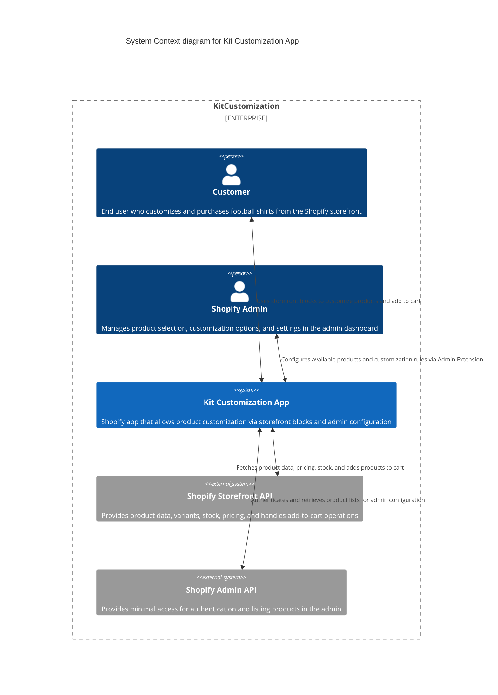

# 3. System Scope and Context

## 3.1 Business Context

The Kit Customization App integrates into a Shopify store and provides:

- An **admin interface** for merchants to configure customizable products.
- A **storefront block** that allows end customers to personalize and purchase products.

Primary interactions:

- **Shopify Admins** configure which products are customizable.
- **End Customers** personalize and purchase products directly from the storefront.

## 3.2 Technical Context

Main components and external systems:

- **Shopify Storefront API**
  - Provides product data, variants, prices, and stock.
  - Handles add-to-cart functionality.

- **Shopify Admin API**
  - Used minimally for authentication and listing products in admin.

### System Context Diagram (textual)

- **Customer (browser)** → interacts with **Theme App Extension** (Liquid block).
- **Theme App Extension** → communicates with **Remix Backend API** and **Shopify Storefront API**.
- **Admin (Shopify)** → interacts with **Admin Extension (Polaris UI)**.
- **Admin Extension** → communicates with **Remix Backend API** and **PostgreSQL database**.

### System Context Diagram (visual)

