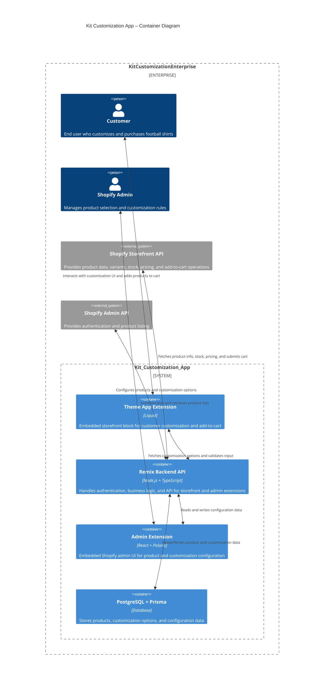
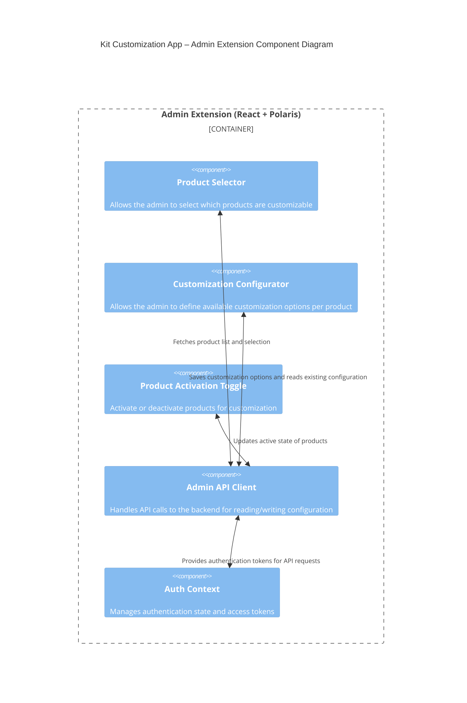
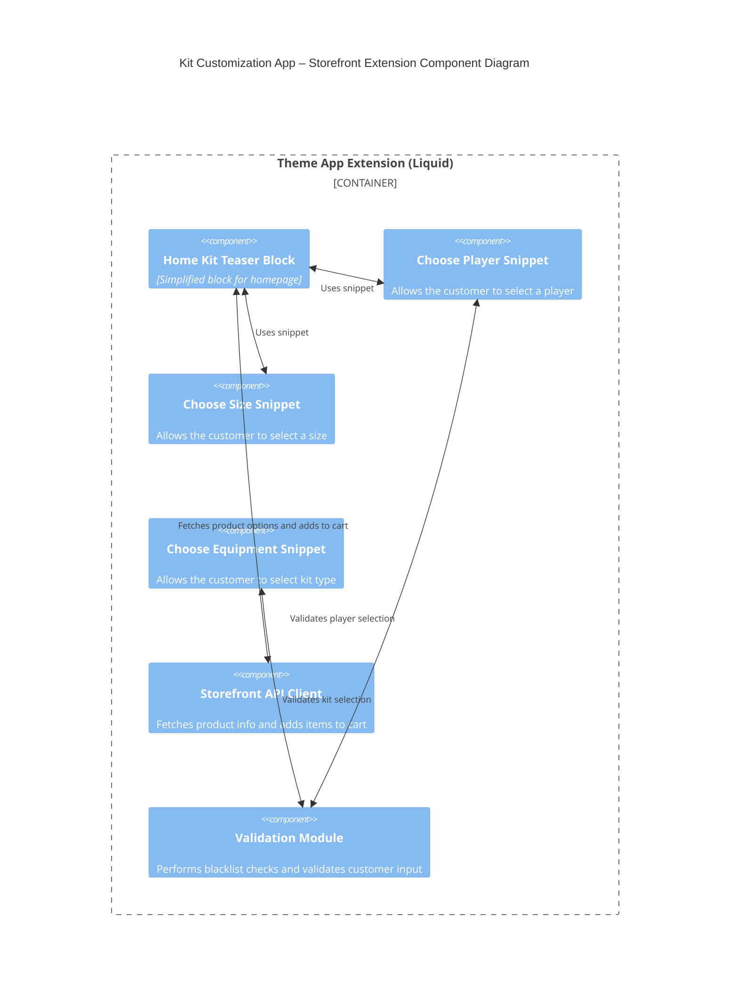

# 5. Building Block View

## 5.1 Level 1 (System Overview – C4 Container Diagram)

- **Kit Customization App**
  - Admin Extension (Polaris UI)
  - Theme Extension (Liquid component)
  - Remix Backend API
  - PostgreSQL Database



## 5.2 Level 2 (Main Components – C4 Component Diagram)

- **Remix Backend**
  - Auth Controller (Shopify OAuth)
  - Admin API Controller (customization config)
  - Storefront API Proxy (fetch product data, stock, pricing)
  - Validation Module (blacklist checks, input sanitization)
  - Persistence Layer (Prisma + PostgreSQL)

  ```mermaid
  C4Component
    title Kit Customization App – Backend Component Diagram

    Container_Boundary(Backend, "Remix Backend API") {
        Component(AuthController, "Auth Controller","", "Handles Shopify OAuth authentication for admins and storefront")
        Component(AdminAPIController, "Admin API Controller", "", "Provides endpoints for configuration of products and customization options")
        Component(StorefrontAPIProxy, "Storefront API Proxy", "", "Fetches product data, variants, stock, and pricing from Shopify Storefront API")
        Component(ValidationModule, "Validation Module", "", "Performs blacklist and input validation for customization fields")
        Component(PersistenceLayer, "Persistence Layer", "", "Prisma ORM for PostgreSQL database access")
    }

    %% Relationships
    BiRel(Admin, AdminAPIController, "Configures products and customization options")
    BiRel(StorefrontExtension, StorefrontAPIProxy, "Fetches available options and validates input")
    BiRel(AuthController, AdminAPIController, "Provides authentication tokens")
    BiRel(AdminAPIController, PersistenceLayer, "Reads/Writes configuration and product data")
    BiRel(StorefrontAPIProxy, PersistenceLayer, "Reads product and customization data")
    BiRel(StorefrontAPIProxy, Shopify_Storefront_API, "Fetches product info, stock, pricing")

  ```

- **Admin Extension**
  - Config UI
  - Product Selection
  - Customization Rules Management



- **Theme Extension**
  - UI Renderer (Liquid block)
  - Cart Integration
  - Live Preview


